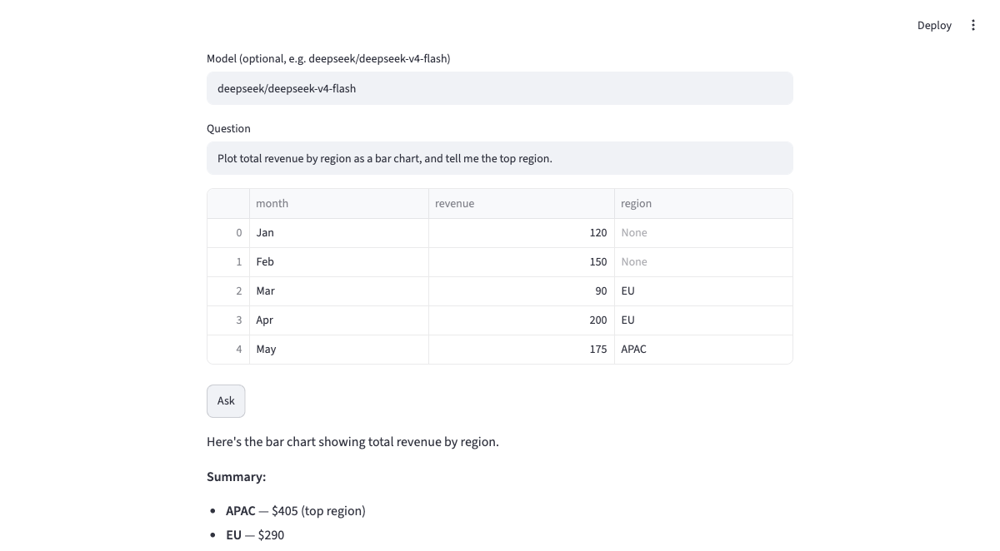

# Examples

Runnable scripts live in [`examples/`](https://github.com/maxkskhor/data-harness/tree/main/examples).
Run them with `uv run python examples/<name>.py`. Most need a provider key
(`OPENROUTER_API_KEY` etc.); the cache benchmark and offline tests don't.

| Example | What it shows | Needs |
|---|---|---|
| [`live_demo.py`](https://github.com/maxkskhor/data-harness/blob/main/examples/live_demo.py) | `ask()`, charts, and SQL on a cheap model | API key |
| [`demo.ipynb`](https://github.com/maxkskhor/data-harness/blob/main/examples/demo.ipynb) | executed end-to-end notebook (all features) | API key |
| [`streamlit_app.py`](https://github.com/maxkskhor/data-harness/blob/main/examples/streamlit_app.py) | upload a CSV, ask, see answer + chart inline | API key, `[demo]` |
| [`eval_demo.py`](https://github.com/maxkskhor/data-harness/blob/main/examples/eval_demo.py) | multi-model eval leaderboard (`--suite hard\|large\|messy\|bespoke`) | `OPENROUTER_API_KEY`, `[eval]` |
| [`eval_wtq.py`](https://github.com/maxkskhor/data-harness/blob/main/examples/eval_wtq.py) | WikiTableQuestions public benchmark | `OPENROUTER_API_KEY`, `[eval]` |
| [`cache_benchmark.py`](https://github.com/maxkskhor/data-harness/blob/main/examples/cache_benchmark.py) | code-replay cache: zero-token repeat questions | none (deterministic) |
| [`mcp_demo.py`](https://github.com/maxkskhor/data-harness/blob/main/examples/mcp_demo.py) | use an external MCP server's tools through the harness | API key, `[mcp]` |
| [`advanced_wiring.py`](https://github.com/maxkskhor/data-harness/blob/main/examples/advanced_wiring.py) | explicit `Harness` wiring with connectors, planner, subagents | `ANTHROPIC_API_KEY` |
| [`inspect_run.py`](https://github.com/maxkskhor/data-harness/blob/main/examples/inspect_run.py) | `RunResult` / JSONL run inspection | API key |
| [`quickstart.py`](https://github.com/maxkskhor/data-harness/blob/main/examples/quickstart.py) | minimal `Agent` example | `ANTHROPIC_API_KEY` |

## The Streamlit demo

```bash
pip install "data-harness[demo]"
uv run streamlit run examples/streamlit_app.py
```

<p align="center">

</p>

## A multi-model eval run

```bash
uv run python examples/eval_demo.py --suite messy
# prints a cost leaderboard and writes evals/results/messy_<ts>.{json,md}
```

See [Evaluation](evaluation.md) for the suites and graders, and the committed
[results summary](evaluation.md#results).
