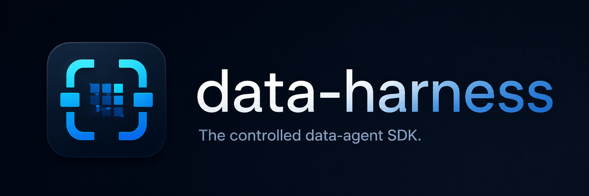

# data-harness

<p align="center">

</p>

**The controlled data-agent SDK.** Python, not bash. Large data stays in a cache
as handles, never in the prompt. Every run is logged — and eval-backed.

Most data-agent tooling makes you pick between giving a model a **shell**
(unsafe, irreproducible) and **single-shot code-gen** (no state, no multi-step).
`data-harness` is the controlled middle path: the model works through a
constrained Python interpreter, large objects live in a `SessionCache` exposed
as compact handle snapshots (so a 100k-row table never hits the context window),
every turn is logged to JSONL, and a built-in [evaluation harness](guide/evaluation.md)
measures quality and cost across providers.

---

## Install

```bash
pip install data-harness          # core
pip install "data-harness[all]"   # + openai, charts, duckdb, sqlalchemy, notebook, eval
```

Requires Python 3.10+. Pick individual extras as needed: `[openai]`, `[viz]`,
`[duckdb]`, `[sql]`, `[notebook]`, `[eval]`, `[demo]`.

---

## 30-second example

```python
import pandas as pd
from data_harness import ask

df = pd.read_csv("sales.csv")
result = ask(df, "What was total revenue, and which month was highest?")

print(result.text)    # the written answer
print(result.value)   # the structured result the model computed via answer()
result.charts         # any charts it rendered (notebook-friendly)
```

Or from the shell:

```bash
dh "What was total revenue?" sales.csv
```

`ask()` resolves a provider from your environment (`OPENROUTER_API_KEY`,
`ANTHROPIC_API_KEY`, `OPENAI_API_KEY`, or `DEEPSEEK_API_KEY`) and returns a
`RunResult`. See the [Quickstart](guide/quickstart.md).

---

## What you get

- **[Quickstart](guide/quickstart.md)** — `ask()`, `Chat`, the `dh` CLI, and inspecting results.
- **[Asking questions](guide/asking.md)** — charts, SQL, the semantic layer, multi-provider, and production controls (sandbox, approval gate, replay cache).
- **[Evaluation](guide/evaluation.md)** — programmatic graders, multi-turn cases, cost leaderboards, and tracked results.
- **[Sessions](guide/sessions.md)** · **[Connectors](guide/connectors.md)** · **[Async & Streaming](guide/async.md)** — multi-turn state, progressive tools, streaming.
- **[Examples](guide/examples.md)** — runnable scripts and a demo notebook.
- **[Architecture](guide/design.md)** — *why* the harness is built this way (no bash, handle/snapshot, prefix-stable prompt, subagents, JSONL logs).

---

## Design series

The thinking behind `data-harness`:

- [Designing a ReAct Harness for Data Workflows Without Bash](https://maxkskhor.substack.com/p/designing-a-react-harness-for-data)
- [How a Bash-Free Data Agent Remembers Its Work](https://maxkskhor.substack.com/p/how-a-bash-free-data-agent-remembers)
- [The Bugs Hidden Inside a Data Agent Harness](https://maxkskhor.substack.com/p/the-engineering-invariants-behind)

License: MIT.
